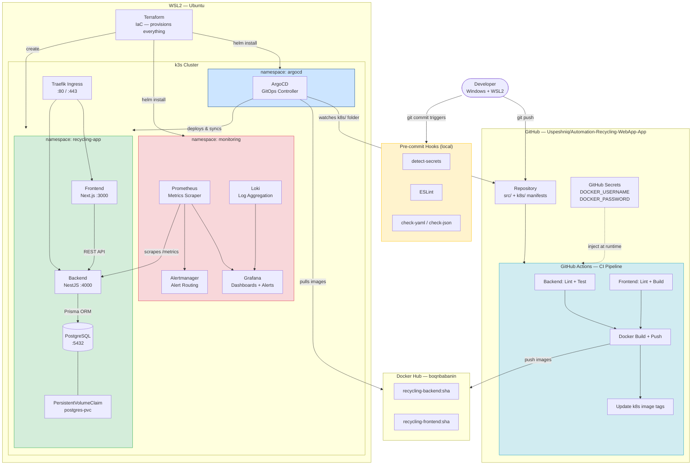

# Infrastructure Diagram

## Component Roles

| Component | Role | Requirement Covered |
|---|---|---|
| GitHub Actions | CI Pipeline — lint, test, build, push | CI Pipeline |
| ArgoCD | CD — GitOps, auto-sync k8s manifests | CD |
| k3s | Kubernetes orchestrator (local) | Orchestrator |
| Terraform | Provisions namespaces + Helm charts | IaC |
| detect-secrets + ESLint | Block secrets and bad code before commit | Pre-commit hooks |
| Prometheus + Grafana | Metrics + Dashboards + Alerting | Observability + Alerting |
| Loki + Promtail | Log aggregation | Observability (logs) |
| GitHub Secrets | CI secrets (Docker Hub creds) | Secrets Management |
| Kubernetes Secrets | Runtime secrets (DB URL, JWT) | Secrets Management |

## Data Flow

1. Developer pushes code → pre-commit hooks run (secrets scan, lint)
2. GitHub Actions CI: lint → test → build Docker image → push to Docker Hub
3. CI updates image tag in `k8s/base/*/deployment.yaml` and commits `[skip ci]`
4. ArgoCD detects the manifest change → pulls new image → rolls out to k3s
5. Prometheus scrapes `/metrics` from backend every 15s
6. Grafana displays dashboards; Alertmanager fires alerts on anomalies
